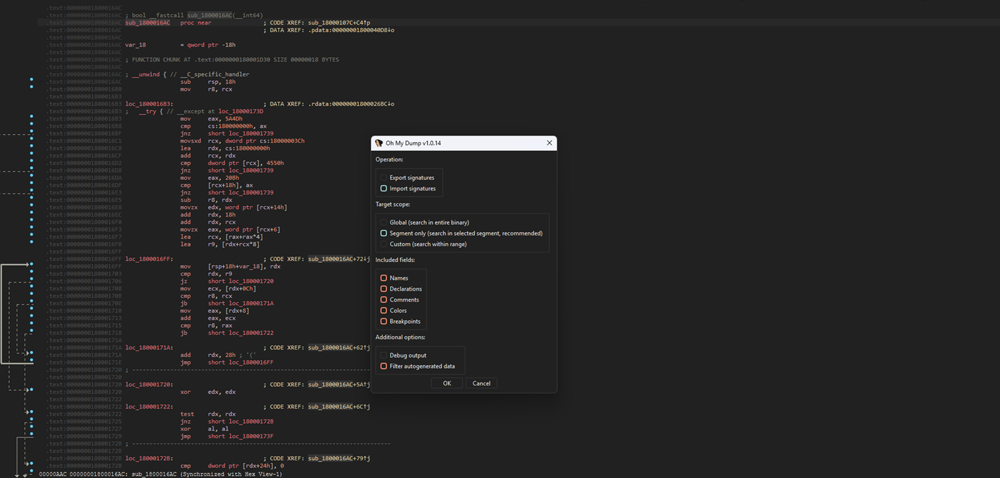
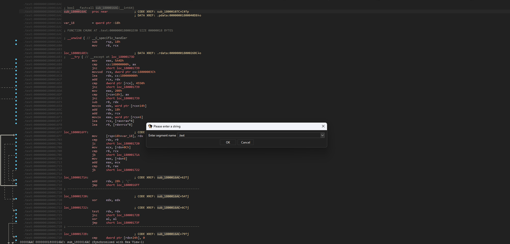
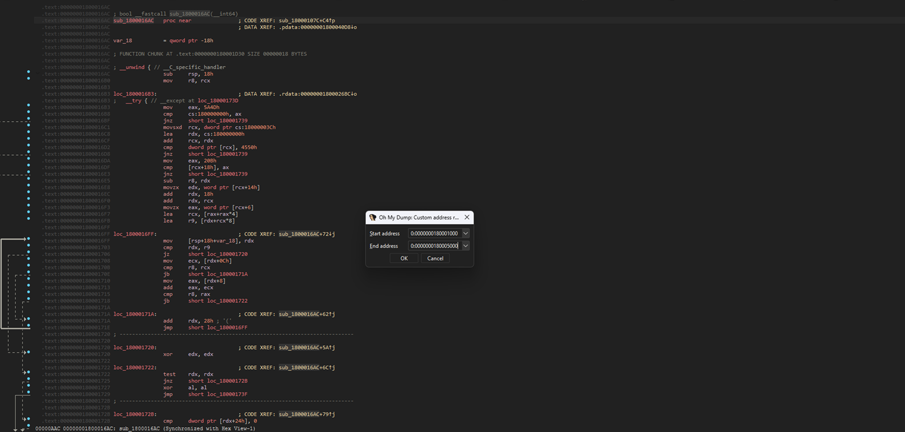
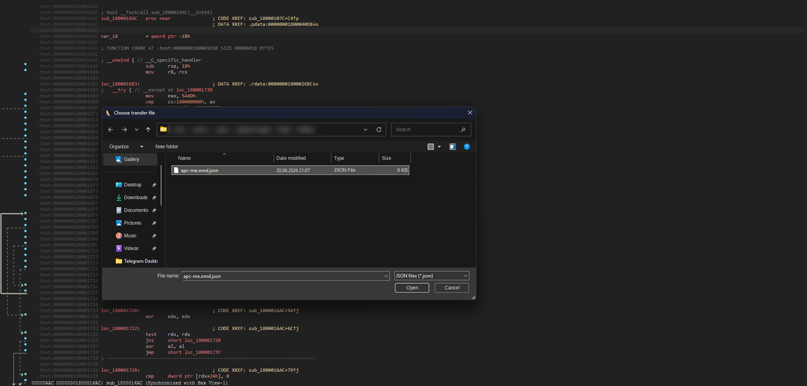
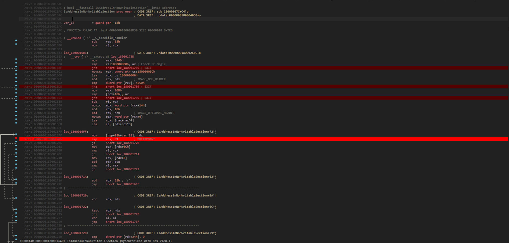
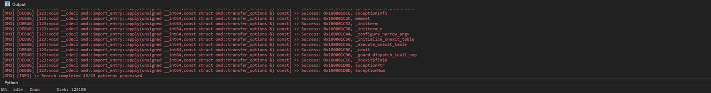

# Oh My Dump


## Description
**Oh My Dump** is built for IDA Pro 9.x and helps carry analysis results over between different versions of the target binary.
The plugin exports analysis data and imports it into a dump from the same binary family (newer or older version), reducing the amount
of repeated manual work needed to rename items and analyze the program's control flow.

## FLIRT & Lumina Server Diff
The project was written before **FLIRT** gained the ability to create signatures directly from an **IDB** (**IDA Pro 8.x**).
That said, **Oh My Dump** is still useful because it handles cases that neither **FLIRT** nor **Lumina Server** fully covers.

**FLIRT** works well for recognizing functions by signature, but it is not designed to carry over the full analysis context.
**Oh My Dump** covers a broader set of data: global variables, function and global-variable declarations, comments, colors, and breakpoints.

**Lumina Server** is a more capable alternative for transferring metadata, but it has limitations too.
**Lumina** is primarily focused on function metadata, so it does not cover global variables or breakpoints.
It also ties data to the function's **MD5** hash, which can be inconvenient when moving analysis between modified versions of a binary.

## Limitations
Unfortunately, **Oh My Dump** has a number of limitations that may be fixed in the future.
For now, the project supports only **x86** and **x86-64** and does not work with other architectures.

Data export can also be slow: the process is single-threaded, and the current algorithm is too bad to be fast at the moment :(.
This can take a noticeable amount of time on large dumps.

The final limitation is related to filtering auto-generated IDA data.
The rules are currently hardcoded and cannot be edited without recompiling, so in rare cases the filter may accidentally discard user data during export.

## Requirements
- IDA Pro 9.x **(tested only on 9.x)**.

## Capabilities
**Oh My Dump** can transfer the following analysis data between IDBs:
- Function and variable names;
- Function and global variable type declarations;
- Comments on functions, instructions, and data items;
- Background colors;
- Breakpoints;

## Installation
- Put it into plugins folder of **your** IDA installation.

## Usage
> To avoid repeating the same information, the import workflow is shown below. The same steps also apply to export.

Launch the plugin by pressing hotkey (by default “**Ctrl+Shift+F10**”) or via **Edit -> Plugin -> Oh My Dump**. 
Select the action, search area, fields and debug flag in the settings window.



For large dumps, limit the search range: analyzing large address ranges can take longer than usual.
When selecting **“Global”**, we skip entering segment name and address range and proceed to json file selection.
If you select **“Segment only”** you will need to enter the segment name (default is .text).



If you select **“Custom”** you will need to enter the range: start and end address. **(default value: ea_min | ea_max)**



Select ***.omd.json** with signatures and wait for the search and signing to complete.



## Result




## JSON configuration format
The plugin uses **JSON files** to define signature patterns and their associated metadata. Each pattern is an object in a JSON array.

## Field reference
| Field                      | Required | Type | Description                                                                                                                                                                                                                                                                          |
|----------------------------|----------|------|--------------------------------------------------------------------------------------------------------------------------------------------------------------------------------------------------------------------------------------------------------------------------------------|
| `signature`                | + | string | Byte pattern with wildcards (`?` or `??` for unknown bytes)                                                                                                                                                                                                                          |
| `name`                     | - | string | Sets name for function/variable at the found address                                                                                                                                                                                                                                 |
| `declaration`              | - | string | Sets function/variable type and name                                                                                                                                                                                                                                                 |
| `comment`                  | - | string | Adds comment to address or function                                                                                                                                                                                                                                                  |
| `color`                    | - | number | Sets background color (RGB value in decimal format)                                                                                                                                                                                                                                  |
| `operations`               | - | array | Array with data (`offset`, `insn_format`) for calculating final effective address. Possible fields: offset, insn_format. Fields can be arranged in any order and repeated.Operations executed sequentially from lower to higher index                                                |
| `operations[].offset`      | - | number | Is used for calculating final effective address by using basic operation (to current address += offset)                                                                                                                                                                              |
| `operations[].insn_format` | - | array | Is used for obtaining relative offset. Calculation is performed as follows: for instruction at 0x1000 `"E8 12 34 56 78"` with format `[1,4]`: `rip = 0x1000 + 1 + 4`, `rel_offset = read_dword(0x1000 + 1)`, `final_address = rip + rel_offset`                                      |
| `breakpoint`               | - | array | Breakpoint configuration `[exist, type, size]`. Type: 0=software+execute (default), 1=write, 2=read, 3=read/write, 4=software, 8=execute, 12=default. Size is irrelevant for software breakpoints. For hardware breakpoints size matters but can't always be set to arbitrary values |

## Example configuration
```json
[
  {
    "name": "function_with_comment",
    "signature": "  E8 ? ? ? ? 0F B7 45 ? 41 B9",
    "declaration": "void* function_with_comment(int value);",
    "operations": [
      {
        "insn_format": [
          1,
          4
        ]
      },
      {
        "offset": 26
      },
      {
        "insn_format": [
          1,
          4
        ]
      }
    ],
    "comment": "Some important function for important matters",
    "color": 15658724,
    "breakpoint": [
      true,
      0,
      0
    ]
  },
  {
    "name": "global_variable",
    "signature": "48 8B 05 ?? ?? ?? ?? 4C 8B 14 D0",
    "operations": [
      {
        "insn_format": [
          3,
          4
        ]
      }
    ],
    "comment": "Something very important"
  },
  {
    "name": "some_math_handler",
    "signature": "48 89 5C 24 ? 48 89 74 24 ? 48 89 7C 24 ? 55 41 56 41 57 48 8B EC"
  },
  {
    "comment": "just_comment",
    "signature": "7E ? 83 F9 ? 7E ? 83 F9 ? 74 ? 7E"
  }
]
```

## Build requirements
- C++20 or later;
- CMake 3.31 or later;
- IDA SDK 9.x or later;
- vcpkg;

## Build
1. Install `vcpkg` and set the `VCPKG_ROOT` environment variable.
2. Fetch baseline: `cd $VCPKG_ROOT && git fetch origin e1dfb369fc1c6e58d5850cf67c224caa955309e5`.
3. Set `IDA_ROOT` to your IDA installation directory.
4. Configure: `cmake --preset msvc-x64`.
5. Build: `cmake --build --preset msvc-x64 --config Release`.

## License
**oh-my-dump** is distributed under the [MIT License](LICENSE).
